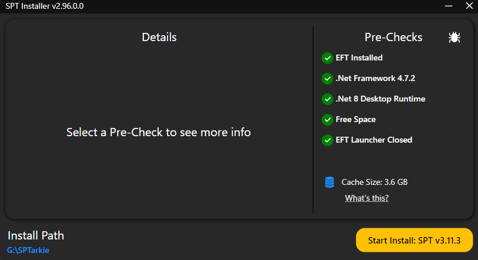

# Installation (New User)

## Prerequisites
There are some prerequisites that you will need for the installation process.
1. A legal copy of Escape From Tarkov (any edition will work, recommend the standard edition because you can select the higher tier editions with SPT mod).
2. 7-Zip or Winrar for modded .zip or .rar files
3. EFT: Dead Sector Modpack (will be linked).
4. A VPN service **Recommended:** RAdmin Software (to connect to MPT servers with Host).
5. Ensure that during the installation process, that both installations of Escape from Tarkov and SPT are on the same drive.

## Step 1
Head to Escape from Tarkov's official website to create an account, purchase, and download Escape From Tarkov. [here](https://www.escapefromtarkov.com/)

*If you are buying Tarkov exclusively to use SPT, it is recommended to just purchase the Standard Edition. (You will be able to select any edition listed on the website through the SPT launcher when creating your profile.)*

After you have purchased Escape From Tarkov, install the launcher to your folder of choice. It will install the Battlestate Launcher. When it finishes installing, the launcher opens after install. It will then prompt you to choose a location to install the game. (it is suggested to install it in the same location as the launcher for ease of access). 

Once the game has finished downloading, your install folder location should look like this (The designated folder for EFT can be named whatever you want):

Now head to SPT's website [here](https://sp-tarkov.com) and download the installer to the location of your choice (/downloads or on your desktop). 

## STEP 2

In the same location as your Escape from Tarkov install, create a new folder. (For this example, I named my folder SPTarkov.)

Place your SPTinstaller.exe in your SPT folder.

Click on the SPTinstaller.exe file. A window will appear. The installer will have some pre-checks on the right side for some extra required files. If you do not have the required .NET files downloaded yet, please download them now:

[.NET Framework 4.7.2](https://dotnet.microsoft.com/en-us/download/dotnet-framework/net472) 

[.NET 8.0 Desktop Runtime](https://dotnet.microsoft.com/en-us/download/dotnet/8.0) 

Once you have all pre-checks with a green check-mark, you are now able to click the “Start Install: SPT v3.10.5" on the bottom right. This will automatically install and clone the required files into your SPT folder.

Once the install finishes, you should be prompted with a message saying “Happy playing”.

Your SPT folder should now look like this:

## STEP 3

Here we will set up the multiplayer aspect of SPT. Let's first start with the VPN.

We will be using RADMIN VPN to connect to online. (This is suggested by Project FIKA) [Radmin's Website](https://www.radmin-vpn.com)

Let’s set up Radmin now.
1. Download the installer and install the program
2. Open the application and the window should appear. 
3. Click on the network tab in the navigation.

4. Click "Join Network +"

5. A modal will appear with the network name and password. Here are the credentials to join:
   a. Network Name: MPT Tarkie
   b. Password: 123456
*The Network Name is case sensitive*

6. The network will appear in your RAdmin window now. There should be a dropdown option on the network name. Click that. You can copy the active network IP that has green bars. 
7. In our case, my IP for the server will be ***26.253.144.19***

*Now we can proceed with the Project FIKA installation*

The following steps will be a guide on how to install the Project Fika/MPT files for our SPT server to run multiplayer. 
*(Be sure to follow these steps carefully or you could run into an error when launching.)*

Head to the installation page for Projecct FIKA. Browse their WIKI for any extra information you may need. [here](https://github.com/project-fika/gitbook-wiki/tree/main/installing-fika)

   a. Download [Fika-Plugin](https://github.com/project-fika/Fika-Plugin/releases/latest)

   b. Download [fika-Server](https://github.com/project-fika/Fika-Plugin/releases/latest)

Extract the files from both downloads into your SPT Directory. You should now be good to test if your server is running properly.

Click and open your "SPTLauncher.exe" file. After it opens, you will get an error saying no server is running. This is fine. What you want to do is click on the settings tab on the top right corner of the navigation window.

Enable "Developer Mode" and locate the URL address bar below it.

In the URL field, type in the corresponding IP address to connect to the host's server. In this case, you can copy and pastethe provided URL: ***https://26.253.144.19:6969***

**BE SURE THE URL LOOKS EXACTLY LIKE IT DOES ABOVE**

Press the arrow on the top right of the window and then close your launcher. 

## STEP 5

Here we will install the modpack for EFT - DEAD SECTOR. This is a simple drag and drop process.

Download the latest version of [EFT - DEAD SECTOR]()

Extract the files into your SPT main directory.

## STEP 6

Now start the SPTServer.exe file. It will take some time to initialize for the first time. Wait until everything has loaded and the message: ***happy playing!*** appears. 

Now click and open your SPTLauncher.exe file again. You should be able to create a profile now. It will prompt you to select your edition of choice. Select the one you want. 

Once your profile has been created, launch the game!
